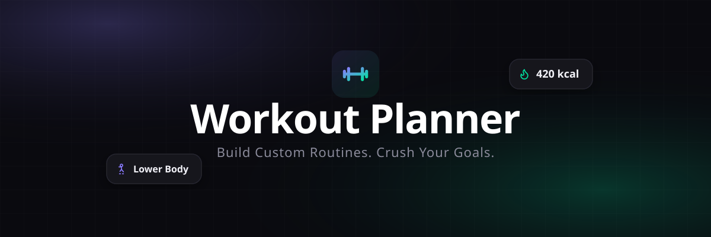

<div align="center">



# ⚡️ Workout Planner

**A premium, immersive, zero-dependency workout planner built for the modern web.**

[](https://workout.chinmayjha.tech)
[](https://chinmayjha.tech)


</div>

## 📖 Overview
Workout Planner is a highly responsive, glassmorphism-inspired fitness application designed to help users build custom routines, track rest times, and crush their fitness goals. Built entirely with Vanilla web technologies, it features an intelligent adaptive rest algorithm, voice coaching, native drag-and-drop mechanics, and a fluid, app-like experience across all devices.

## ✨ Key Features

*   **🎧 Smart Audio Coaching:** Utilizes the Web Speech API to address you by name and provide real-time voice cues and detailed form reminders for every exercise.
*   **🫀 Ambient Pulse & Haptics:** Integrates the Web Vibration API and CSS animations for a synchronized pulsing "heartbeat" countdown during the final 3 seconds of intense sets.
*   **📊 Lifetime Stats Dashboard:** Automatically tracks and saves your total workouts, minutes trained, and calories burned to `localStorage`.
*   **🛡️ Workout Safety Lock:** Prevents accidental data loss by locking the UI tabs and triggering a warning dialog if you try to leave an active workout.
*   **🖱️ Drag & Drop Builder:** Effortlessly construct and reorder your daily routine using native HTML5 drag-and-drop functionality.
*   **🎨 Premium Frosted Glass:** Features a custom CSS `-webkit-backdrop-filter` UI that scales perfectly across Desktop and iOS devices, plus 25 unique, minimal SVGs mapped specifically to individual movements.
*   **💾 Zero Backend:** 100% client-side logic requiring no databases or external dependencies.

## 🛠️ Tech Stack
This project was built with performance and simplicity in mind, requiring absolutely no build steps, package managers, or external dependencies.

*   **HTML5:** Semantic architecture, Web App Manifest, and native drag-and-drop.
*   **CSS3:** Custom CSS variables, CSS Grid/Flexbox, frosted glass UI, cross-browser minimal scrollbars, and keyframe animations.
*   **JavaScript (Vanilla ES6):** State management, Web Speech API, Web Vibration API, and DOM manipulation.

## 🚀 Getting Started

Since this project has zero dependencies, getting it running locally is incredibly simple.

1.  **Clone the repository:**
    ```bash
    git clone [https://github.com/chinmayjha/workout-planner.git](https://github.com/chinmayjha/workout-planner.git)
    ```
2.  **Open the project folder:**
    ```bash
    cd workout-planner
    ```
3.  **Run the app:**
    Simply open the `index.html` file in your preferred web browser. No local server is required unless you plan to test specific push notification APIs.

## 🔧 Customization (Adding Exercises)

You can easily expand the application's library by modifying the `EXERCISES` array in `app.js`.

```javascript
{
  id: 'new-exercise',
  name: 'Your New Exercise',
  cat: 'upper', // Options: upper, lower, core, cardio, full
  cue: 'A brief tip for form and execution.',
  time: 45, // Default time in seconds
  tts: 'Phonetic spelling for the voice coach'
}
```

To add a custom SVG for your new exercise, simply add a matching `id` key to the `EX_ICONS` object in `app.js`.

## 👨‍💻 About the Author

**Chinmay Jha**  
*Student • Web Developer • Freelancer*

I am a 17-year-old web developer from India. I started coding at 11, and I specialize in building fun, functional, and highly polished web projects and user interfaces. 

🌐 **Portfolio:** [chinmayjha.tech](https://chinmayjha.tech)  
🐙 **GitHub:** [@chinmayjha](https://github.com/chinmayjha)  
✉️ **Email:** contact@chinmayjha.tech

## 📄 License

This project is open-source and available under the [MIT License](LICENSE). Feel free to fork, modify, and use it in your own projects!